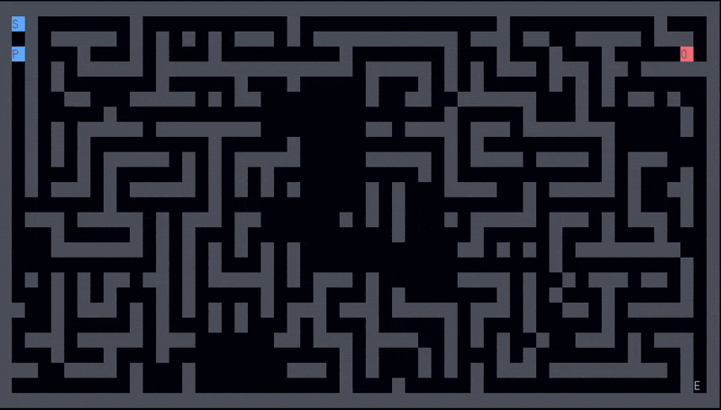

# Maze Chase Game

A terminal-based maze escape game where you must reach the exit before the AI opponent catches you. Features both human and bot play modes.



## Game Description

Navigate through a procedurally generated maze using arrow keys or WASD controls, or watch an intelligent bot navigate for you. Your goal is to reach the exit (E) before the opponent (O) catches you. The maze features multiple pathways and open spaces, allowing for strategic gameplay and multiple escape routes.

## Controls & Game Modes

### Mode Selection (First Input)
- **Press 'B'**: Activate Bot Mode - watch the AI navigate intelligently
- **Press Arrow Keys or WASD**: Play as Human - control the player yourself

### Movement Controls (Human Mode)
- **Arrow Keys** or **WASD**: Move your character
  - Up: ↑ or W
  - Down: ↓ or S
  - Left: ← or A
  - Right: → or D

## Gameplay

- **Player (P)**: You start at position S (start)
- **Opponent (O)**: AI-controlled enemy that chases you
- **Exit (E)**: Your goal - reach this to win
- **Walls**: Black cells - cannot pass through
- **Paths**: Clear cells - can move freely

### Speed Mechanics
- Player moves **every game tick** (very responsive)
- Opponent moves **every 4 game ticks** (slower, strategic threat)
- Bot player moves **every game tick** (same speed as human)
- Game updates every **75 milliseconds**

### Bot AI Behavior
When in Bot Mode, the AI player uses advanced pathfinding with opponent avoidance:
- **Danger Zone Detection**: Identifies areas near the opponent
- **Risk-Based Routing**: Chooses longer paths to avoid close encounters
- **Dynamic Replanning**: Adjusts path in real-time as opponent moves
- **Escape Priority**: Balances reaching exit with staying safe

## Compilation

### Windows (MinGW)
```bash
g++ main.cpp -o game
```

### Running the Game
```bash
./game
# or
game.exe
```

### Requirements
- Windows OS (uses `conio.h` and `windows.h`)
- MinGW or similar C++ compiler
- C++11 or higher

## Important Data Structures

### 1. **Position Struct**
```cpp
struct Position {
    int x;
    int y;
};
```
- **Purpose**: Represents a coordinate in the 2D maze
- **Usage**: Tracks player location, opponent location, start, and exit positions
- **Operators**: Implements `==`, `!=`, and `<` for comparison and use in maps

### 2. **Maze Representation - 2D Vector**
```cpp
vector<vector<char>> maze
```
- **Type**: 2D dynamic array (vector of vectors)
- **Purpose**: Stores the entire maze grid
- **Values**:
  - `'#'` = Wall (impassable)
  - `' '` = Path (walkable space)
- **Dimensions**: Width × Height (typically 55×27)

### 3. **Stack (for Maze Generation)**
```cpp
stack<Position> cell_stack
```
- **Algorithm**: Recursive Backtracker
- **Purpose**: Implements depth-first search for maze generation
- **Behavior**: 
  - Push current cell when visiting
  - Pop when backtracking (no unvisited neighbors)
  - Creates perfect maze with guaranteed solution

### 4. **Queue (for AI Pathfinding)**
```cpp
queue<Position> q
```
- **Algorithm**: Breadth-First Search (BFS)
- **Purpose**: Finds shortest path from opponent to player
- **Behavior**:
  - Explores all positions at distance N before distance N+1
  - Guarantees shortest path in unweighted grid

### 5. **Map (for BFS Parent Tracking)**
```cpp
map<Position, Position> parent
```
- **Purpose**: Records the path taken during BFS
- **Key**: Current position
- **Value**: The position we came from
- **Usage**: Backtrack from player to opponent to find first step

### 6. **Map (for BFS Visited Tracking)**
```cpp
map<Position, bool> visited
```
- **Purpose**: Prevents revisiting cells during BFS
- **Optimization**: Ensures O(V + E) time complexity
- **Key**: Position
- **Value**: Boolean (true if visited)

### 7. **Random Number Generator**
```cpp
mt19937 g(seed)
```
- **Type**: Mersenne Twister pseudo-random generator
- **Purpose**: Generates random maze layouts
- **Seed**: Based on current time (unique each run)
- **Usage**: 
  - Shuffling neighbor selection in maze generation
  - Random wall removal for open spaces
  - Room placement

### 8. **Priority Queue (for Bot AI)**
```cpp
priority_queue<pair<int, Position>, vector<pair<int, Position>>, greater<pair<int, Position>>> pq
```
- **Algorithm**: A* pathfinding
- **Purpose**: Finds optimal path while avoiding opponent
- **Structure**: Min-heap ordered by f-cost (g-cost + h-cost)
- **Usage**:
  - Explores lowest-cost positions first
  - Balances path length with danger avoidance
  - Efficiently finds safest route to exit

### 9. **Cost Map (for Bot AI)**
```cpp
map<Position, int> cost
```
- **Purpose**: Tracks g-cost (actual movement cost) to each position
- **Key**: Position in maze
- **Value**: Total cost including danger penalties
- **Danger Penalties**:
  - Distance ≤ 2 to opponent: +100 penalty
  - Distance ≤ 4 to opponent: +50 penalty
  - Distance ≤ 6 to opponent: +20 penalty

## Algorithms Used

### Maze Generation: Recursive Backtracker
1. Start at position (1,1)
2. Mark current cell as visited (path)
3. Get all unvisited neighbors (2 cells away)
4. If neighbors exist:
   - Randomly choose one
   - Remove wall between current and chosen
   - Push chosen to stack and repeat
5. If no neighbors, backtrack (pop stack)
6. Continue until stack is empty

### Maze Enhancement
After base generation:
1. **Room Creation**: Carve out 3-6 cell rectangular open areas
2. **Connection Addition**: Remove walls between existing paths to create loops
3. **Random Wall Removal**: Further open the maze for gameplay balance

### Opponent AI: Breadth-First Search (BFS)
1. Start from opponent position
2. Explore all reachable neighbors
3. Track parent of each visited cell
4. Stop when player is found
5. Backtrack through parent map to find first step
6. Move opponent to that first step

**Why BFS?** Guarantees opponent always takes shortest path, creating consistent challenging behavior.

### Bot Player AI: A* with Danger Zones
1. Initialize priority queue with start position
2. For each position, calculate:
   - **g-cost**: Actual movement cost + danger penalty
   - **h-cost**: Manhattan distance to exit (heuristic)
   - **f-cost**: g-cost + h-cost (total estimated cost)
3. Add danger penalties based on distance to opponent:
   - Very close (≤2): Avoid heavily (+100)
   - Close (≤4): Avoid moderately (+50)
   - Nearby (≤6): Slight avoidance (+20)
4. Always explore lowest f-cost positions first
5. Backtrack to find first step when exit reached
6. If no safe path exists, move away from opponent

**Why A*?** Efficiently finds optimal path while incorporating danger avoidance. The heuristic guides search toward the exit while penalties keep the bot away from threats.

## Game Loop Structure

```
Initialize maze, player, opponent
Display instructions
While (not game over):
    1. Render game state
    2. If mode not selected:
       - Wait for first input (B for bot, movement key for human)
       - Process first input
    3. If mode selected:
       - Bot mode: Calculate AI move using A*
       - Human mode: Handle keyboard input
    4. Update opponent AI (every 4 ticks)
    5. Check win/lose conditions
    6. Increment tick counter
    7. Sleep 75ms
Display result
```

## Color Scheme

- **Walls**: Black background
- **Paths**: Default terminal color
- **Player (P)**: White text on blue background
- **Opponent (O)**: White text on red background
- **Start/Exit**: Context-appropriate colors

## Features

- [x] **Dual Play Modes**: Human or Bot player  
- [x] **Intelligent Bot AI**: Uses A* with danger zone avoidance  
- [x] Procedurally generated mazes (unique each playthrough)  
- [x] Multiple pathways and strategic routing  
- [x] Responsive player movement  
- [x] Intelligent opponent using shortest-path algorithm  
- [x] Balanced gameplay (player 4x faster than opponent)  
- [x] Keyboard input buffering to prevent lag  
- [x] Real-time terminal rendering with ANSI colors  
- [x] Dynamic mode selection during gameplay  

## Technical Notes

- Uses Windows-specific libraries (`conio.h`, `windows.h`)
- ANSI escape codes for colors (may not work in all terminals)
- Input buffering flushed each tick to prevent queued moves
- Console cursor hidden during gameplay for smoother visuals

---

**Enjoy the game and good luck escaping!**